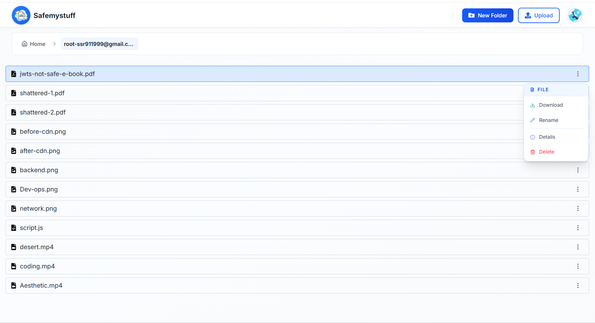
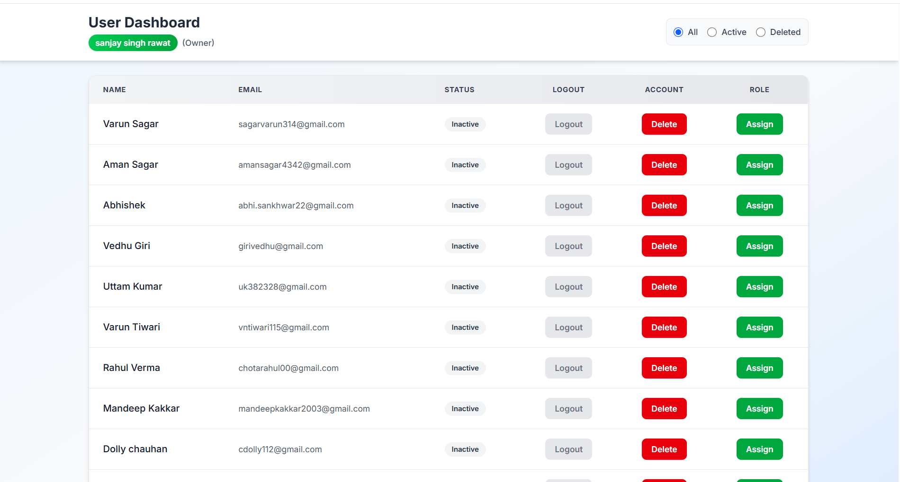
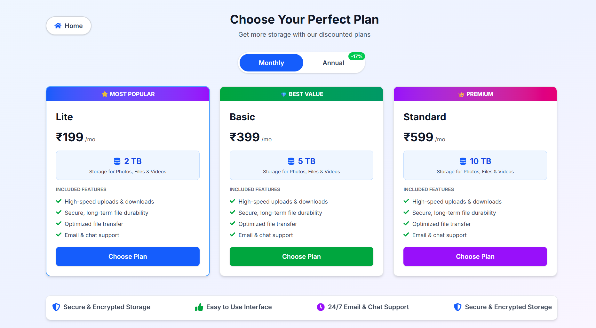
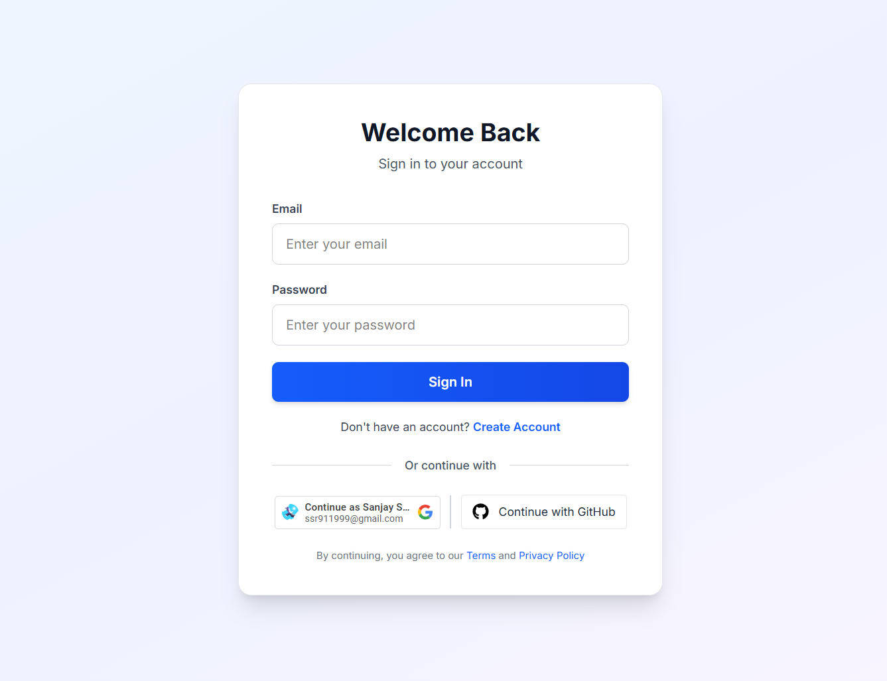
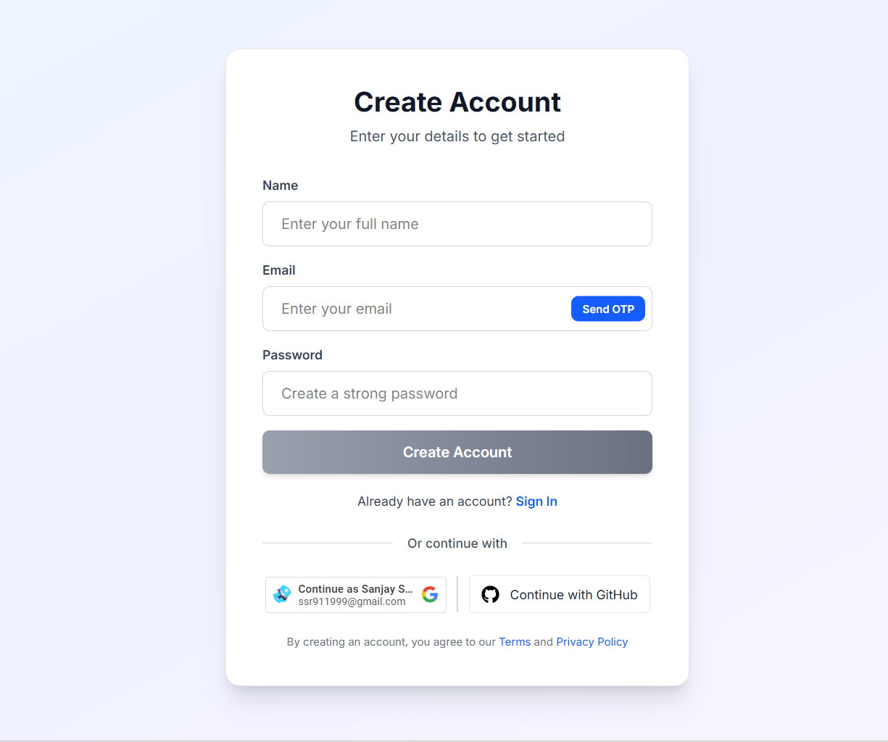
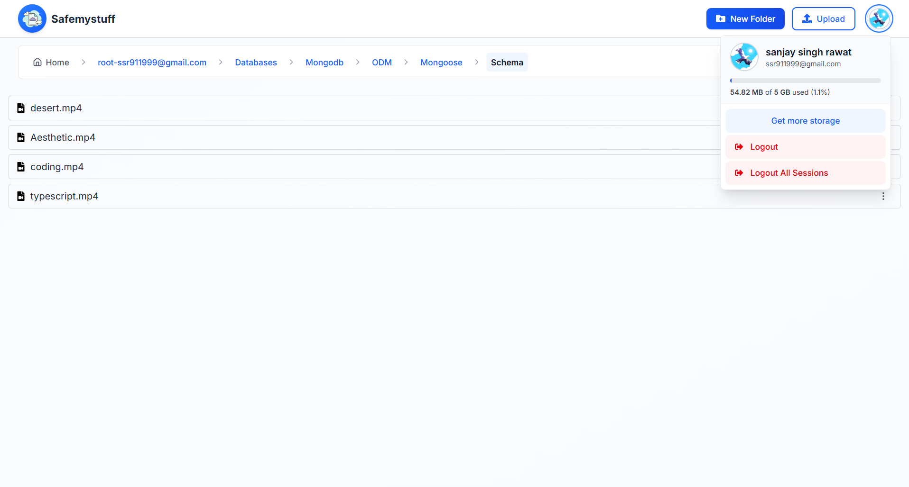
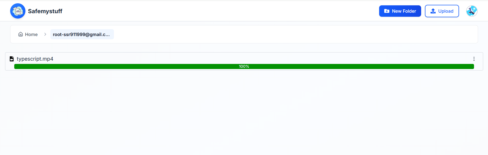

# 🚀 Safemystuff - Secure Cloud Storage Platform

<div align="center">


**A production-ready cloud storage platform built for speed, security, and reliability**

<!-- [](https://safemystuff.store)
[](LICENSE)
[](https://nodejs.org)
[](https://reactjs.org) -->

</div>

---

## 📋 Table of Contents

- [Overview](#-overview)
- [Features](#-features)
- [Screenshots](#-screenshots)
- [Tech Stack](#-tech-stack)
- [Architecture](#-architecture)
- [Security](#-security)
- [Installation](#-installation)
- [Environment Variables](#-environment-variables)
- [Deployment](#-deployment)
- [API Documentation](#-api-documentation)
- [Contributing](#-contributing)
- [License](#-license)

---

## 🌟 Overview

**Safemystuff** is a secure, scalable cloud storage platform inspired by Google Drive. Built with modern web technologies and enterprise-grade security practices, it provides users with a seamless file management experience while maintaining the highest standards of data protection and performance.

### Key Highlights

- 🔐 **Bank-level Security** - End-to-end encryption and secure authentication
- ⚡ **Lightning Fast** - CDN-powered global content delivery
- 📊 **Role-Based Access** - Granular permission control (Owner, Admin, Manager, User)
- 💳 **Integrated Payments** - Razorpay subscription management with webhooks
- 🎯 **Production Ready** - Deployed with PM2, Nginx, and SSL/TLS

---

## ✨ Features

### 📁 File & Folder Management
- Create, upload, organize, and navigate files effortlessly
- Drag-and-drop file uploads with progress tracking
- Folder hierarchy with breadcrumb navigation
- File preview and download capabilities
- Real-time storage usage monitoring



### 👥 Advanced Role-Based Access Control (RBAC)

| Role | Permissions |
|------|------------|
| **Owner** | Full system access: view all users, filter, logout anyone, delete users, assign roles |
| **Admin** | User management: view users, logout users, delete accounts |
| **Manager** | Limited access: view users, logout users only |
| **User** | Standard access: manage own files and folders |



### ☁️ Cloud Storage Infrastructure
- **AWS S3** for reliable object storage
- **CloudFront CDN** for global edge delivery
- Signed URLs for secure file access
- Automatic file compression and optimization

### 🔒 Security Features
- Private routes with secure Authorization
- Bcrypt password hashing (10 salt rounds)
- OTP email verification for registration
- Zod schema validation
- DOMPurify for XSS prevention
- Content Security Policy (CSP) headers
- Rate limiting and throttling
- Schema validation at database and application levels

### 💳 Payment Integration
- **Razorpay** live payment gateway
- Subscription plan management (Lite, Basic, Premium)
- Automated webhook integration for payment tracking
- Auto-update subscription plans on successful payment
- Storage quota management based on plans



### ⚡ Performance & Reliability
- **Redis** for session management and caching
- **PM2** for process management and auto-restart
- **Nginx** as reverse proxy server
- **SSL/TLS** via Let's Encrypt (Certbot)
- CDN edge caching for fast global delivery
- Horizontal scalability support

---

## 📸 Screenshots

### Login Page


### Register Page


### Dashboard


### File Upload


### User Management (Admin)


---

## 🛠 Tech Stack

### Frontend
- **React.js 18** - UI library
- **React Router** - Client-side routing
- **Tailwind CSS** - Utility-first styling
- **Lucide React** - Icon library
- **Axios** - HTTP client
- **DOMPurify** - XSS sanitization
- **Google OAuth** - Social authentication

### Backend
- **Node.js** - Runtime environment
- **Express.js** - Web framework
- **MongoDB** - Database
- **Mongoose** - ODM
- **Redis** - Session store
- **JWT** - Authentication tokens
- **Bcrypt** - Password hashing
- **Zod** - Schema validation
- **Nodemailer** - Email service

### Cloud & DevOps
- **AWS S3** - Object storage
- **CloudFront** - CDN
- **PM2** - Process manager
- **Nginx** - Reverse proxy
- **Certbot** - SSL certificates
- **Ubuntu Server** - Hosting

### Payment
- **Razorpay** - Payment gateway
- **Webhooks** - Payment tracking

---

## 🏗 Architecture

```
┌─────────────────┐
│   Client (React)│
│   + Tailwind CSS│
└────────┬────────┘
         │
         │ HTTPS/TLS
         ↓
┌────────────────────┐
│   Nginx (Proxy)    │
│   + SSL/TLS        │
└────────┬───────────┘
         │
         ↓
┌────────────────────┐
│  Aws EC2 Server    │
│  + Session Auth    │
│  + Rate Limiting   │
└────┬──────────┬────┘
     │          │
     ↓          ↓
┌─────────┐  ┌──────────┐
│ MongoDB │  │  Redis   │
│         │  │ (Session)│
└─────────┘  └──────────┘
     │
     ↓
┌──────────────────┐
│   AWS S3         │
│   + CloudFront   │
└──────────────────┘
```

---

## 🔐 Security

### Authentication & Authorization
- JWT-based authentication with HTTP-only cookies
- Refresh token rotation
- Role-based access control (RBAC)
- Session management with Redis

### Data Protection
- Bcrypt password hashing (10 rounds)
- OTP email verification
- Encrypted file storage on AWS S3
- Signed URLs with expiration
- Input validation with Zod
- XSS prevention with DOMPurify

### Network Security
- HTTPS/TLS encryption
- Content Security Policy (CSP)
- CORS configuration
- Rate limiting (45 requests per 15 minutes)
- Request throttling
- Helmet.js security headers

### Validation Layers
1. Client-side validation (React)
2. Schema validation (Zod)
3. Database schema validation (Mongoose)
4. Sanitization (DOMPurify)

---

## 🚀 Installation

### Prerequisites
- Node.js 18+ and npm/yarn
- MongoDB 5+
- Redis
- AWS Account (S3, CloudFront)
- Razorpay Account

### Clone Repository
```bash
git clone https://github.com/yourusername/safemystuff.git
cd safemystuff
```

### Backend Setup
```bash
cd backend
npm install
cp .env.example .env
# Configure environment variables (see below)
npm run dev
```

### Frontend Setup
```bash
cd frontend
npm install
cp .env.example .env
# Configure environment variables
npm start
```

---

## 🔧 Environment Variables

### Backend (.env)
```env
# Server
PORT=5000
NODE_ENV=production

# Database
MONGODB_URI=mongodb://localhost:27017/safemystuff

# Redis
REDIS_HOST=localhost
REDIS_PORT=6379

# JWT
JWT_SECRET=your_jwt_secret_here
JWT_EXPIRES_IN=7d

# AWS
AWS_ACCESS_KEY_ID=your_aws_key
AWS_SECRET_ACCESS_KEY=your_aws_secret
AWS_REGION=us-east-1
S3_BUCKET_NAME=safemystuff-storage
CLOUDFRONT_DISTRIBUTION_URL=https://your-cloudfront.net

# Email (Nodemailer)
EMAIL_HOST=smtp.gmail.com
EMAIL_PORT=587
EMAIL_USER=your-email@gmail.com
EMAIL_PASSWORD=your-app-password

# Razorpay
RAZORPAY_KEY_ID=your_key_id
RAZORPAY_KEY_SECRET=your_key_secret
RAZORPAY_WEBHOOK_SECRET=your_webhook_secret

# Client URL
CLIENT_URL=https://safemystuff.store

# GitHub OAuth
GITHUB_CLIENT_ID=your_github_client_id
GITHUB_CLIENT_SECRET=your_github_client_secret
```

### Frontend (.env)
```env
REACT_APP_API_URL=https://api.safemystuff.store
REACT_APP_GOOGLE_CLIENT_ID=your_google_client_id
REACT_APP_GITHUB_CLIENT_ID=your_github_client_id
```

---

## 🌐 Deployment

### Server Setup (Ubuntu)

```bash
# Update system
sudo apt update && sudo apt upgrade -y

# Install Node.js
curl -fsSL https://deb.nodesource.com/setup_18.x | sudo -E bash -
sudo apt install -y nodejs

# Install MongoDB
# Follow: https://docs.mongodb.com/manual/installation/

# Install Redis
sudo apt install redis-server -y

# Install Nginx
sudo apt install nginx -y

# Install PM2
sudo npm install -g pm2

# Install Certbot
sudo apt install certbot python3-certbot-nginx -y
```

### Deploy Backend
```bash
cd backend
npm install --production
pm2 start server.js --name safemystuff-api
pm2 startup
pm2 save
```

### Deploy Frontend
```bash
cd frontend
npm run build
# Serve build folder with Nginx
```

### Nginx Configuration
```nginx
server {
    listen 80;
    server_name safemystuff.store www.safemystuff.store;
    return 301 https://$server_name$request_uri;
}

server {
    listen 443 ssl http2;
    server_name safemystuff.store www.safemystuff.store;

    ssl_certificate /etc/letsencrypt/live/safemystuff.store/fullchain.pem;
    ssl_certificate_key /etc/letsencrypt/live/safemystuff.store/privkey.pem;

    root /var/www/safemystuff/build;
    index index.html;

    location / {
        try_files $uri $uri/ /index.html;
    }

    location /api {
        proxy_pass http://localhost:5000;
        proxy_http_version 1.1;
        proxy_set_header Upgrade $http_upgrade;
        proxy_set_header Connection 'upgrade';
        proxy_set_header Host $host;
        proxy_cache_bypass $http_upgrade;
    }
}
```

### SSL Certificate
```bash
sudo certbot --nginx -d safemystuff.store -d www.safemystuff.store
```

---

## 📚 API Documentation

### Authentication Endpoints

#### Register User
```http
POST /api/auth/register
Content-Type: application/json

{
  "name": "John Doe",
  "email": "john@example.com",
  "password": "securePassword123",
  "otp": "1234"
}
```

#### Login
```http
POST /api/auth/login
Content-Type: application/json

{
  "email": "john@example.com",
  "password": "securePassword123"
}
```

### File Operations

#### Upload File
```http
POST /api/file/upload
Authorization: Bearer {token}
Content-Type: multipart/form-data

{
  "file": [file],
  "parentDirectoryId": "optional_folder_id"
}
```

#### Get Directory Contents
```http
GET /api/directory/:id
Authorization: Bearer {token}
```

### User Management (Admin)

#### Get All Users
```http
GET /api/users
Authorization: Bearer {token}
```

#### Delete User (Admin/Owner)
```http
DELETE /api/users/:id
Authorization: Bearer {token}
```

---

## 🤝 Contributing

Contributions are welcome! Please follow these steps:

1. Fork the repository
2. Create a feature branch (`git checkout -b feature/AmazingFeature`)
3. Commit your changes (`git commit -m 'Add some AmazingFeature'`)
4. Push to the branch (`git push origin feature/AmazingFeature`)
5. Open a Pull Request

### Coding Standards
- Follow ESLint configuration
- Write meaningful commit messages
- Add tests for new features
- Update documentation

---

## 👨‍💻 Author

**Sanjay Singh Rawat**

- Email: ssr911999@gmail.com
- GitHub: [@ssrawat1](https://github.com/ssrawat1)
- LinkedIn: [Sanjay Singh Rawat
](https://www.linkedin.com/in/sanjay-singh-rawat-a39b11302/)

---

## 🙏 Acknowledgments

- Inspired by Google Drive
- AWS for cloud infrastructure
- Razorpay for payment integration
- Open source community

---

## 📈 Project Stats

<div align="center">

**⭐ Star this repo if you find it helpful!**

Made with ❤️ by Sanjay Singh Rawat

</div>